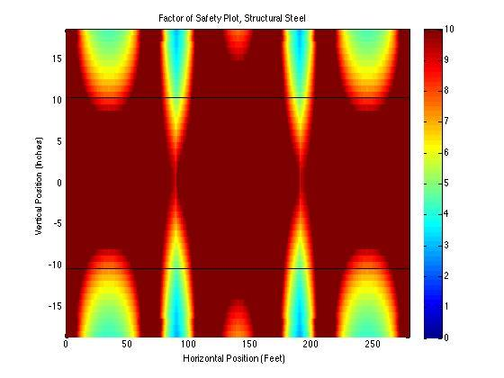
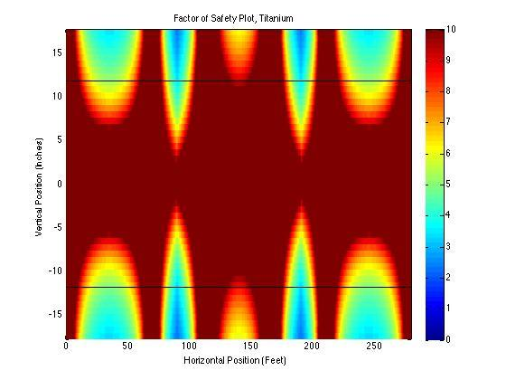

# Hunts point Bridging

A highway overpass analysis project.

## Problem Introduction

This project’s topic is analyzing the I-beams supporting a freeway overpass. Analysis like this is a vital part of the overpass design process, which ensures such a bridge is safe for public use. Bridges are often supported using roller-type connections to allow expansion and minor movement (Carmichael). We have therefore simplified the overpass as an indeterminate beam on pin and roller connections supporting a distributed load. Using Matlab, we have created a program that finds:

- The bridge’s support reactions
- Shear, bending moment, angle and displacement diagrams
- Maximum and minimum of each of these
- Locations where the moment equals zero
- Required wide-flange beam cross-section
- Stress state at various points, including transformations and principal stresses
- Overall factor of safety.

In approaching our problem, we hoped to meet the objectives of:

- Improving our statics skills
- Solving for indeterminate reactions
- Finding shear and bending moment equations and diagrams for beams
- Becoming more proficient with Matlab
- Finding beam displacement equations
- Using failure criteria and principal stresses to find factor of safety
- Solving systems of linear equations, by hand and with numerical methods
- Using numerical methods to find roots
- Selecting beam cross-section using maximum bending moment criteria

To ensure a realistic bridge design, we based the distance between the supports on the Krenek bridge in Crosby, Texas (“Chapter 3”) and the cross-section on a sample provided by the U.S. Department of Transportation (“Concrete Deck Design”). We determined the distributed load due to the concrete deck by multiplying a typical concrete density supplied by the Portland Cement Association (“Frequently Asked Questions”) times the deck’s cross-sectional area. The distributed load representing traffic was estimated based on maximum truck lengths (“Vehicle Lengths”) and weights (“Weight Limitations”) allowed by CalTrans. Our factor of safety was based on a CalTrans document on bridge design stating 2.2 is a typical factor of safety for structural steel (“Chapter 1”). Material properties were drawn from Mechanics of Materials by Beer, while some of our superposition equations used in our solution also came from Strength and Stiffness of Engineering Systems by Frederick Leckie and a sheet put out by the National Technical University of Athens (“Beam Deflection Formulae”).

## Problem Statement

The above freeway bridge is held up by one pin support and three roller supports. The concrete deck is supported by five wide-flanged I-beams, and it can be represented by a distributed load of 8350 lbs/ft. The bridge’s maximum potential load can be approximated by a distributed load of 2150 lbs/ft (assuming bumper-to-bumper semi-trucks carrying maximum loads). Assume that all five I-beams carry an equal load, the weights of the beams are negligible, and that the concrete deck has no structural significance. For one beam:

1. Find all reaction forces and moments.
2. Plot the shear and bending moment diagrams.
3. Find the positions on the beam where the bending moment is zero.
4. Find the minimum and maximum shear force and bending moment.
5. Using the maximum bending moment, for the following materials, find a wide-flanged beam cross-section that will support the bridge, given a factor of safety of 2.2.
    - Structural steel: σyield = 58 ksi, E = 29x106 psi
    - Aluminum alloy 7075-T6: σyield = 73 ksi, E = 10.4x106 psi
    - Titanium: σyield = 120 ksi, E = 16.5x106 psi
    1. Plot deflection and slope, and find the maximum deflection and slope.
6. Find the state of stress (σxx, σyy, τxy) for the point on the beam x = 100 ft, y = 9 in. Transform the stress to an angle of 45° use stress transformation equations. Plot σxx, σyy, τxy with respect to transformation angle, and draw Mohr’s Circle for the point.
7. Make a false color plot of factor of safety using von Mises failure criteria. Identify the beam’s overall factor of safety.

## Calculations

### Initial Distributed Load Calculations

Truck Length = 75 ft  
Truck Weight = 80,000 lbs  

Distributed Load of 2 Trucks = \= 2134

Bridge:  
  
Length                 280 ft  
Outside Shoulder         10 ft  
Lane Width                 12 ft  
Deck Depth                 1 ft  
Rail Width                1.5 ft  

Total Bridge Width =  = 47ft

Typical Concrete Unit Weight = 145 (“Frequently Asked Questions”)

Bridge Weight =  = 2,334,500 lbs

Distributed Load due to Bridge Deck Weight =  = 8,337.5 

Total Distributed Load = 2134\+ 8,338  = 10,472

Per beam =  = 2094.4

To make the numbers even for the problem statement and result in a slightly conservative estimate, we rounded the distributed load for the trucks up to 2150 lbs/ft and the distributed load for the deck up to 8350 lbs/ft, resulting in a total distributed load of 10,500 lbs/ft and a load of 2,100 lbs/ft for each beam.

Solve for Reactions for the Support Pins on the Beam

Sum of forces in the “Y” direction:

ΣFy = 0 →   

Sum of the moments around pin A:

ΣMa \= 0 →   

Displacement of the beam at pin B and C equals zero (“Beam Deflection Formulae”):  
Pin B:

yb \= 0 →     

Pin C:

yc \= 0 →    

Put above equations into a matrix. The coefficients go into matrix \[A\], variables into matrix {R}, and the constants into matrix {b}:

 

\[A\]= {b}=

{R}=

Perform the LU factorization on the matrixes:

L= U=

Perform forward and back substitution in order to find the {R} matrix:

  → 

  → 

Reaction Values:

Ra\=73.488 kips  
Rb\=220.512 kips  
Rc\=220.512 kips  
Rd\=73.488 kips

Shear-Moment Equations

Where  is the distance from the end to the supports (90 ft) and  is the length of the beam (280 ft):

Section AB

Section BC

Section CD

Maximum/Minimum Shear

Maximum shear is found at the beginnings of each section:

Minimum shear is found at the ends of each section:

Maximum/Minimum Moment

Maximum moment is found where the derivative equals zero in each section:

Minimum moment is found at the beginnings or ends of each section:

Solve for locations where M = 0:

Section AB

Section BC

Section CD

a = -1.050

a = -1.050

a = -1.050

b = 73.49

b = 294.00

b = 514.51

c = 0

c = -19845.90

c = -61742.80

x = 0 ft, 69.99 ft

x = 113.56 ft, 166.44 ft

x = 210.01 ft, 280 ft

Using the quadratic formula like this finds an exact solution; the fzero function used in our program instead applies numerical methods to find an approximation.

I-Beam Selection (Structural Steel)

Beams that exceed this S:

W36x302, 

Only possible beam, therefore it must be used

W36x302

Depth: 

Flange Width: 

Flange Thickness: 

Web Thickness: 

Moment of Inertia: 

### Slope/Deflection

The equations for the deflection (δ) were derived using superposition. Our beam can be broken up into two cases, a simply supported beam under a uniform distributed load (weight of materials and the weight of the traffic load), and two equal, symmetrically positioned point loads (the two center supports). The deflection equation for a simply supported beam under a uniform distributed:

The deflection equations for two symmetrically placed, equal point loads are:

 for 

and

 for 

For our example the two point loads are supports in the middle, which requires a sign change in the equation. To combine the equations we simply add the displacement equations together to yield the following displacement equations. To derive the slope (θ) equations we took the derivative of the displacement equations to yield the following slope equations.

Slope (θ):

Displacement (δ):

Stress State at arbitrary point (100 ft, 9 in)

All measurements in inches unless stated otherwise

Beam Dimensions:

d = 37.3 in

tf = 1.680 in

tw = .9450 in

bf = 16.70 in

Moment and Shear Calculations:

V = 294.00 – 2.100(100)

V = 84.0 kips

M = -1.050(100)2 \+ 29.40(100)-19,845.9

M = -945.9 kip\*lb

Stress Calculations:

I = 21,100in4 (taken from appendix in Mechanics of Materials by Beer)

Q =

Q = 597.48 in3

\= 

 = 

xx = 

xx = 

### Stress Transformation

θ = 45° (arbitrary angle)

\+ cos(2) 

Principal Stresses

Principal Plane

Factor of Safety at point, von Mises Criteria

### Script File Output

 Ra            Rb             Rc              Rd         (kips)

 73.488        220.512        220.512         73.488

 Min Shear(kips)   Max Shear(kips)   Min Moment(kip-ft)  Max Moment(kip-ft)

 -115.512           115.512           -1891.094            1285.825

Moment is zero at points (feet):

 0.000      69.988     113.562    166.438    210.012    280.000

 Structural Steel

Beam type: W36 x 302

Area: 88.800 in^2

Depth: 37.300 in

Flange Width: 16.700 in

Flange Thickness: 1.680 in

Web Thickness: 0.945 in

Moment of Inertia: 21100.000 in^4

 Min Slope     Max Slope     Min Displacement(in)   Max Displacement(in)

\-5.789e-05     5.789e-05     -1.681e-02               000

 sigma xx (ksi)    sigma yy(ksi)   tau xy(ksi)   angle(degrees)

 -0.096         4.938          -2.421         45.000

 Principle Stresses (ksi)         Principle Planes (degrees)

 -1.071          5.914         -23.055         66.945

 Overall Factor of Safety: 2.891594

 Aluminum alloy 7075-T6

Beam type: W33 x 201

Area: 59.200 in^2

Depth: 33.700 in

Flange Width: 15.700 in

Flange Thickness: 1.150 in

Web Thickness: 0.715 in

Moment of Inertia: 11600.000 in^4

 Min Slope     Max Slope     Min Displacement(in)   Max Displacement(in)

\-2.936e-04     2.936e-04     -8.528e-02         2.665e-15

 sigma xx (ksi)    sigma yy(ksi)   tau xy(ksi)   angle(degrees)

 0.829         7.979          -4.404         45.000

Principle Stresses (ksi)         Principle Planes (degrees)

 -1.268         10.077         -19.534         70.466

 Overall Factor of Safety: 2.214556

 Titanium

Beam type: W36 x 135

Area: 39.700 in^2

Depth: 35.600 in

Flange Width: 12.000 in

Flange Thickness: 0.790 in

Web Thickness: 0.600 in

Moment of Inertia: 7800.000 in^4

 Min Slope     Max Slope     Min Displacement(in)   Max Displacement(in)

\-2.752e-04     2.752e-04     -7.994e-02               000

 sigma xx (ksi)    sigma yy(ksi)   tau xy(ksi)   angle(degrees)

 2.467        10.633          -6.550         45.000

 Principle Stresses (ksi)         Principle Planes (degrees)

 -1.169         14.268         -15.970         74.030

Overall Factor of Safety: 2.317189

## Conclusion

For this project, we analyzed I-beam structural members of a freeway overpass. We determined the beam reactions; plotted shear, bending moment, slope, and deflection; found the maximum and minimum shear, moment, slope and deflection; located where the moment equals zero; found a suitable I-beam for each material; analyzed stress states across the beam; and found factor of safety. As thorough as our solution was, many possible sources of error exist. The most error will come from our numerous assumptions needed to make our problem solvable, given our limited knowledge. Realistically, our beams do have weight, all five beams do not carry equal loading, and traffic loading is not truly uniform. Small errors may potentially exist due to rounding errors with Matlab’s limited precision, but this precision is high enough that these are negligible. Errors may also exist in finding maximum shear, moment, slope, or deflection because they are found by calculating a series of points and choosing the maximum of those values; accuracy is therefore dependent on the number of points analyzed. Error might be also found in the calculation of our moment roots because Matlab’s fzero function, a numerical method, only finds an approximation rather than an exact solution. Lastly, there is also the very real possibility of human error in deriving the formulae and functions used in solving this problem.

Our chosen solution has several advantages. By defining everything in our program in terms of a few easily obtained variables, we can now analyze any similar symmetrical, pin-roller supported beam with a distributed load by only changing these variables at the beginning of the program. Furthermore, by implementing this as a Matlab program, calculating results takes only a fraction of the time of doing it by hand. Matlab is also capable of carrying out calculations to much higher precision than by hand or with a calculator. A disadvantage is that this is a fairly specific case, restricted to a symmetrical bridge under a uniform distributed load with exactly four supports. We also have the disadvantage of having to rely on our assumptions, when they do not perfectly represent reality.

---

## References

“Beam Deflection Formulae.” National Technical University of Athens. Web. 14 Feb. 2013. <courses.arch.ntua.gr/fsr/141842/Elastiki%20grammi.pdf>.

Beer, Ferdinand P., et al. Mechanics of Materials. 6th ed. New York: McGraw-Hill, 2022. Print.

Carmichael, Adam and Nathan Desrosiers. Comparative Highway Bridge Design. Worchester Polytechnic Institute, 28 Feb. 2008. Web.14 November. 2024. <www.wpi.edu/Pubs/E-project/>

“Chapter 1: Bridge Design Specifications.” Bridge Design Practice. California Department of Transportation, Oct. 2021. Web. 14 November. 2024. <www.dot.ca.gov/hq/esc/techpubs/>

“Chapter 3: Applications for Transportation Projects.” Geotechnical Engineering Circular No. 8: Design and Construction of Continuous Flight Auger Piles. U.S. Department of Transportation Federal Highway Administration, 7 April 2021. Web. 14 November. 2024. <www.fhwa.dot.gov/engineering/geotech/pubs/gec8/03.cfm>.

“Concrete Deck Design Example Design Step 2.” LRFD Steel Girder SuperStructure Design Example. U.S. Department of Transportation Federal Highway Administration, 5 April 2021. Web. 17 November. 2023. <www.fhwa.dot.gov/bridge/lrfd/us\_ds2.htm>.

“Frequently Asked Questions.” Concrete Technology. Portland Cement Association. Web. 8 Feb. 2013. <www.cement.org/tech/faq\_unit\_weights.asp>.

Leckie, Frederick and Dominic Dal Bello. Strength and Stiffness of Engineering Systems. New York: Springer Science + Business Media, 2019.

“Weight Limitations.” California Department of Transportation. California Department of Transportation, 6 July 2022. Web. 14 November. 2024. <www.dot.ca.gov/hq/traffops/trucks/>

“Vehicle Lengths.” California Department of Transportation. California Department of Transportation, 19 July 2022. Web. November. 2024. <www.dot.ca.gov/hq/traffops/trucks/>
